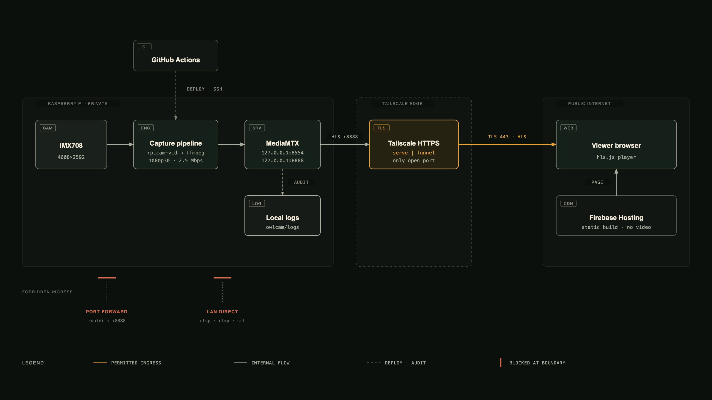

# OwlCam

A Raspberry Pi wildlife camera on a barred owl nest box. The Pi captures and
encodes on-device, serves the page and HLS on localhost only, and Tailscale
provides the single HTTPS door that viewers come through — no router port
forwarding and no viewer accounts.



<sub>Diagram sources: [`docs/architecture-diagram.html`](docs/architecture-diagram.html) (interactive) ·
[`.png`](docs/architecture-diagram.png) · [`.jpg`](docs/architecture-diagram.jpg)</sub>

<sub>**Stale:** the diagram still shows Firebase serving the page. The page moved
to the Pi on 2026-08-30 so it shares an origin with the stream
([why](docs/live-feed.md#why-one-origin)); Firebase now only redirects.</sub>

## One origin, four mounts

Everything a viewer touches comes from a single Tailscale hostname, and
Tailscale remains the only ingress. The page, video, vitals, and authenticated
admin API are separate mounts on port 443, each proxied from loopback:

| Mount | Backed by | Contains |
|---|---|---|
| `/` | `owlcam-site` on `127.0.0.1:8080` | HTML, CSS, photos, the player |
| `/owl` | MediaMTX on `127.0.0.1:8888` | Live H.264 / HLS |
| `/diagnostics` | `owlcam-diagnostics` on `127.0.0.1:8765` | Read-only health JSON |
| `/admin` | `owlcam-admin` on `127.0.0.1:8766` | Authenticated controls and logs |

The page still never proxies video — the browser fetches HLS itself. It just
fetches it from the same origin that served the page, and that is load-bearing:
a page on any other origin is refused access to the private address MagicDNS
returns for this host, so the feed was dead on every device running Tailscale.
See [`docs/live-feed.md`](docs/live-feed.md#why-one-origin).

**Share this:** <https://carver-owlcam-72343.web.app>

It 302s to the Pi, preserving the path, and nothing caches the redirect. That
indirection is the point: if the Pi's hostname changes or the page moves again,
editing `firebase.json` repoints every link already shared. The `ts.net` name is
the thing that can change underneath.

- Origin the Pi serves: <https://owlcam.tail31318f.ts.net/>
- Stream: `https://owlcam.tail31318f.ts.net/owl/index.m3u8`

The trade is availability: the page used to stay up when the Pi was off, and now
it does not. Firebase's redirects are 302 and `no-store` so that stays a config
change rather than a migration.

## Bring up the feed

On the Pi, one command does the whole chain — MediaMTX, camera capture, and
publishing:

```bash
cd /home/shawn/owlcam/deploy
./pi/scripts/serve-stream.sh            # private: tailnet only
./pi/scripts/serve-stream.sh --public   # public: Tailscale Funnel
./pi/scripts/serve-stream.sh --stop     # shut everything down
```

The script starts MediaMTX and the camera only if a capture is not already
running, waits for local HLS to answer, then enables Serve or Funnel and prints
the watch URL and the exposure level. Details and Funnel prerequisites are in
[`docs/live-feed.md`](docs/live-feed.md).

Only one process can own the camera. Never run `serve-stream.sh`,
`pi/scripts/start-stream.sh`, and `scripts/start_stream.sh` at the same time.

### Keeping it up by itself

`serve-stream.sh` is a one-shot bring-up: nothing restarts the feed after a
reboot or a crash. To make it durable, install the services once:

```bash
cd /home/shawn/owlcam/deploy
./pi/scripts/install-services.sh              # install, enable, start
./pi/scripts/install-services.sh --uninstall  # remove
```

That gives you `owlcam-mediamtx`, `owlcam-stream`, `owlcam-site`,
`owlcam-diagnostics`, and `owlcam-admin`. They start at boot and restart within
about five seconds of a failure. `owlcam-site` serves the built page, diagnostics
exposes the public health payload, and admin exposes authenticated controls.

```bash
systemctl --user status owlcam-stream owlcam-mediamtx owlcam-site \
  owlcam-diagnostics owlcam-admin
journalctl --user -u owlcam-stream -n 50
systemctl --user restart owlcam-stream
```

Configure the admin password once on the Pi, then click `?` on any page:

```bash
owlcam-configure-admin
```

See [`docs/admin-panel.md`](docs/admin-panel.md) for the controls, security
boundary, and recovery steps.

These are **user** units, not system units, because the Pi has no passwordless
sudo. The installer runs `loginctl enable-linger`, without which user units stop
when the last SSH session closes and never start at boot at all.

Once the services are installed, do not also run `serve-stream.sh` or the UDP
publisher — they fight the unit for the sensor, and the unit will lose and
restart in a loop. Tailscale publishing is separate and already persists on its
own.

### Who can watch

```bash
./pi/scripts/publish-feed.sh --status    # current exposure
./pi/scripts/publish-feed.sh --public    # anyone with the URL
./pi/scripts/publish-feed.sh --private   # tailnet devices only
```

Going public needs the `funnel` node attribute approved once in the Tailscale
admin console. Until then `--public` refuses and prints the approval URL rather
than hanging, and the feed stays tailnet-only. Exposure applies per port, so the
video and the `/diagnostics` payload are always published together in the same
mode. Details in [`docs/live-feed.md`](docs/live-feed.md).

### Capture defaults

1920x1080 at 30 fps, H.264, capped at 2.5 Mbps. The cap matters: every viewer
pulls the full bitrate, and `rpicam-vid`'s ~10 Mbps default saturates a typical
home upload after two or three of them. Override with `OWLCAM_BITRATE`.

## Security posture

- RTSP (`8554`) and HLS (`8888`) bind to `127.0.0.1`. Nothing on the LAN or the
  tailnet reaches them directly.
- Port 443 via Tailscale is the only ingress, and it serves exactly three
  read-only mounts: the built page, HLS, and the diagnostics payload.
- RTMP, WebRTC, SRT, the admin API, metrics, pprof, and playback are disabled.
- No router port forwarding, ever. That is what the blocked paths in the
  diagram mean.
- Funnel is on, so the video is public and needs no Tailscale account to watch.
  Only three things sit behind it: the built site, MediaMTX HLS, and the
  read-only diagnostics payload, all proxied from loopback. Funnel is
  bandwidth-throttled and
  unauthenticated by design, so restreaming outbound is the answer if the
  audience outgrows home upload. Flip back with
  `pi/scripts/publish-feed.sh --private`. The reasoning is in
  [`docs/live-feed.md`](docs/live-feed.md).

More in [`docs/security.md`](docs/security.md).

## Web app

The page is generated by FastHTML into static files, which the Pi serves. CSS
and JS are content-fingerprinted, so a deploy can never be shadowed by a stale
cached stylesheet.

```bash
cd web
uv run --frozen python -m pytest    # tests
uv run --frozen python build.py     # build to web/public
make pi-deploy                      # build then stage to the Pi, from the repo root
make deploy                         # publish the Firebase redirects
```

A web change is live once `make pi-deploy` finishes; `make deploy` only
republishes the redirects that send Firebase visitors to the Pi. Use `make
deploy` rather than a bare `firebase deploy` — it pins the account, so a stale
directory default cannot publish as the wrong identity.

See [`web/README.md`](web/README.md).

### Personal identity

This machine's global git identity and SSH key belong to a work account, so this
repo overrides both locally. A bare `git push` authenticates as the work user and
gets a `403`; a bare `firebase deploy` fails to find the project.

```bash
make setup-identity
```

That sets the repo-local commit identity, pins git credentials to the personal
GitHub account by name, and pins the Firebase account for this directory only —
nothing global changes, so work projects are unaffected. **Re-run it after
cloning**, because repo-local git config is not carried by a clone.

The credential helper names the account explicitly rather than deferring to
`gh auth git-credential`, which serves whichever account `gh` is currently
switched to. Doing anything in a work repo flips that global, and the next push
here fails with `Permission to ssskillman/owlcam.git denied to
skillman-iterable` even though the repo-local identity is correct. If that error
appears anyway, re-run `make setup-identity`.

## Validation

```bash
make check     # shell syntax, script tests, deploy dry-run, web tests, web build
```

End to end, against a running feed:

```bash
ssh shawn@100.123.8.55 'rpicam-hello --list-cameras'
curl -sSL -o /dev/null -w '%{http_code}\n' https://owlcam.tail31318f.ts.net/owl/index.m3u8
```

A `200` means the page will play. The `-L` matters: MediaMTX redirects the first
manifest request to `?cookieCheck=1`, so without it a healthy feed reports
`302`. Read [`docs/recovery.md`](docs/recovery.md) before changing the
known-good manual stream.

## Deploying to the Pi

The Pi must run 64-bit Raspberry Pi OS on `aarch64`.

```bash
./pi/scripts/install.sh
./pi/scripts/install.sh --check
./pi/scripts/deploy.sh --dry-run
./pi/scripts/deploy.sh
```

### Getting a new commit onto the Pi

The Pi does not clone this repo and never runs `git pull`. Code reaches it by
rsync from a laptop, or from GitHub Actions after a merge to `main`. Two steps,
in this order:

```bash
# 1. On the Mac, from the repo root
git checkout main && git pull
OWLCAM_SSH_IDENTITY=~/.ssh/owlcam_pi make pi-deploy   # builds the site, then stages

# 2. On the Pi
ssh shawn@owlcam.local
cd /home/shawn/owlcam/deploy
./pi/scripts/install-services.sh
```

Step 2 is required after any Pi-side change. `deploy.sh` only stages files; the
installer is what copies them into `~/.local/bin`, reloads the units, and
restarts the services onto the new code.

Two traps worth knowing:

- **Do not SSH to `100.123.8.55` from the Pi itself.** That address *is* the Pi.
  `~/.ssh/owlcam_pi` only exists on the laptop, so the command fails with
  `Identity file ... not accessible` and then prompts for a host key.
- **A running unit keeps its old binary.** `systemctl enable --now` does nothing
  to an already-active service, which is why staged code can appear installed
  while the endpoint still serves the previous payload. The installer now
  restarts all five units for this reason. To confirm what is actually running:

```bash
curl -sS https://owlcam.tail31318f.ts.net/diagnostics
```

A payload with a `climate` object is the current build.

Deployment stages a narrow set of files under `/home/shawn/owlcam/deploy`.
Installing a staged MediaMTX configuration requires an explicit
`--install-config` flag and takes a timestamped backup first. GitHub Actions
runs the same staging over Tailscale after a merge to `main`, and skips with a
notice rather than failing when the Pi is offline
([`docs/github-actions.md`](docs/github-actions.md)).

Runtime configuration belongs in `/etc/owlcam/owlcam.env`; use
[`.env.example`](.env.example) as a non-secret template.

## Repo layout

| Path | What lives there |
|---|---|
| `pi/scripts/` | capture, publish, install, and deploy scripts for the Pi |
| `pi/config/` | MediaMTX configuration and version pin |
| `web/` | FastHTML site, build script, tests, static assets |
| `scripts/` | standalone UDP publisher |
| `tests/` | shell script test suite |
| `docs/` | architecture, runbooks, security, live-feed guide, [next steps](docs/next_steps.md) |

## Known gaps

- The hardened `/etc/mediamtx.yml` currently lives only on the Pi. It is not
  committed to `pi/config/`, and neither is `mediamtx.version`, so
  `install.sh` still fails closed by design.
- Funnel requires the `funnel` node attribute in the tailnet policy. Until it
  is granted, `--public` exits non-zero and only tailnet devices can watch.
  This is currently a deliberate posture rather than a gap — see the exposure
  recommendation in [`docs/live-feed.md`](docs/live-feed.md).
- There is no outbound restream path yet. That is the missing piece for making
  the feed visible to people who will never join the tailnet.
- `ffmpeg` logs `method SETUP failed: 461 Unsupported Transport` once at
  startup, then falls back to RTSP over TCP and publishes normally. It is noise
  rather than a fault; passing `-rtsp_transport tcp` would silence it.

## Appendix: UDP publisher

An alternate path sends H.264 as MPEG-TS over UDP through Tailscale to a
receiver, copying the camera bitstream without re-encoding:

```bash
./scripts/start_stream.sh
OWL_CAM_DEST_IP=100.x.x.x OWL_CAM_DEST_PORT=5000 ./scripts/start_stream.sh
```

The default destination `udp://100.116.197.91:5000` is a Tailscale address, not
a LAN address — keep it that way so the setup survives a house move. Receive
with `ffplay "udp://0.0.0.0:5000"`.

The original hand-off notes are in
[`CURSOR_HANDOFF_OWLCAM.md`](CURSOR_HANDOFF_OWLCAM.md).
